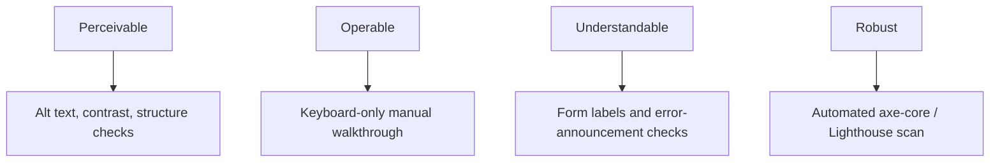

# Accessibility (WCAG) Testing Checklist

A practical, interactive checklist for auditing an application against WCAG's four core principles — Perceivable, Operable, Understandable, Robust (POUR) — covering both what an automated scanner catches and the manual passes it doesn't.

Use this tool to track your accessibility audits; progress is saved automatically in your browser's local storage.

<InteractiveChecklist preset="accessibility" />

---

## WCAG POUR Principles → Testing Map

---

## Automated Scans Are a Floor, Not a Ceiling

Automated tools like axe-core catch real, valuable issues — but industry estimates consistently put automated coverage around 30-40% of WCAG's actual success criteria. Logical tab order, whether an error is genuinely announced at the right moment, and whether a screen reader user can actually complete a task all require a human pass. Treat the automated scan as the fast, CI-gated floor — not the whole audit.

## Related Guides

- [Manual Testing Learning Path](/learning-paths/manual-testing/test-design-fundamentals) — core test design foundations
- [Interview Academy: Manual Testing](/interview-academy/manual-testing) — interview questions and answers
- [API Security & OWASP Checklist](/resources/api-security-testing-checklist) — the sibling audit checklist for backend endpoints
