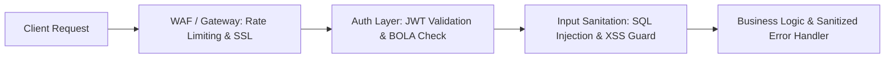

# REST API Security & OWASP Top 10 Checklist

A practical, interactive security verification checklist for QA and SDETs to audit backend endpoints against the OWASP API Security Top 10 guidelines.

Use this tool to track your security audits; progress is saved automatically in your browser's local storage.

<InteractiveChecklist preset="api-security" />

---

## OWASP API Risk Architecture

---

## Related Guides

- [API Security Fundamentals](/learning-paths/api-testing/api-security-fundamentals) — core security risks and defense principles
- [Bulletproof API Assertions in Postman](/blog/bulletproof-api-assertions-postman) — assertions for status, headers, and schemas
- [Interview Academy: API Testing](/interview-academy/api-testing-postman) — master 50+ interview questions on REST & APIs
