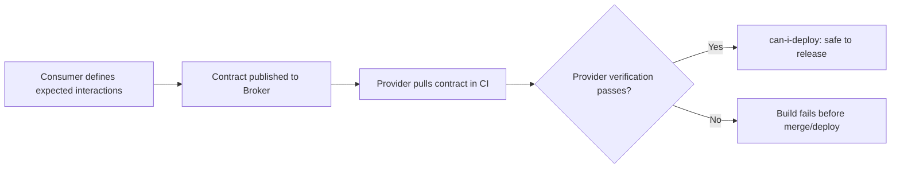

# Consumer-Driven Contract Testing Checklist

A practical, interactive checklist for verifying that two independently-deployed services — a consumer and a provider — actually agree on the shape of the data crossing between them, before that assumption breaks in production.

Use this tool to track your contract-testing setup; progress is saved automatically in your browser's local storage.

<InteractiveChecklist preset="contract-testing" />

---

## Consumer-Driven Contract Testing Flow

---

## Why This Exists

Two services can each pass 100% of their own tests and still break each other the moment they talk — a renamed field, a silently-changed unit, or a status code neither side actually agreed on. Contract testing catches that class of defect at the speed of a unit test, without needing a slow, flaky, fully-integrated environment for every single check.

## Related Guides

- [API Testing Learning Path](/learning-paths/category/api-testing) — full API testing foundations
- [Testing Service Integrations](/learning-paths/api-testing/testing-service-integrations) — testing across service boundaries
- [Bug Museum: Mars Climate Orbiter](/bug-museum) — the $327M defect a typed, unit-explicit contract would have caught
