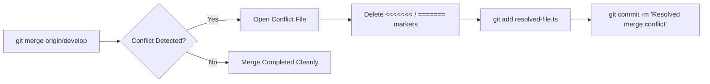

# Git for QA & Automation Engineers Cheat Sheet

A condensed reference of everyday Git commands, troubleshooting recipes, and rollback mechanisms for test automation engineers.

---

## 1. Daily Branching & Syncing

```bash
# 1. Create and switch to a new test branch
git switch -c feature/login-page-tests
# Or (older syntax):
git checkout -b feature/login-page-tests

# 2. Fetch latest changes from remote without merging
git fetch origin

# 3. Pull latest remote develop with rebase (Clean history)
git pull --rebase origin develop

# 4. View visual commit tree
git log --oneline --graph --all -n 10
```

---

## 2. Stashing (Work in Progress)

```bash
# 1. Stash current uncommitted test edits with a descriptive label
git stash push -m "WIP: payment page locators"

# 2. List all stashes
git stash list

# 3. Apply latest stash and KEEP it in stash list (Safer)
git stash apply

# 4. Apply latest stash and REMOVE it from list
git stash pop

# 5. Clear all stashed changes
git stash clear
```

---

## 3. Cherry-Picking & Bisecting (Bug Hunting)

```bash
# 1. Apply a specific bug-fix commit from developer branch to QA branch
git cherry-pick <commit-hash>

# 2. Binary search to find WHICH commit introduced a regression (Git Bisect)
git bisect start
git bisect bad                 # Current commit is broken
git bisect good v2.3.0         # Last known working release tag

# Git will checkout mid-point commits automatically:
# Test the app, then tell Git:
git bisect good                # If test passes
git bisect bad                 # If test fails

# When finished:
git bisect reset               # Return to original HEAD
```

---

## 4. Undoing & Reverting Changes

```bash
# 1. Discard uncommitted changes in a specific file
git restore src/test/java/LoginTest.java

# 2. Unstage a file without losing modifications
git restore --staged config.json

# 3. Undo the last commit but KEEP changes staged
git reset --soft HEAD~1

# 4. Undo the last commit and UNSTAGE changes (keeps local files)
git reset --mixed HEAD~1

# 5. Revert a commit that was already pushed to remote (Safe for teams)
git revert <commit-hash>
```

---

## 5. Conflict Resolution Workflow



---

## Related Guides

- [Interview Academy: Git & GitHub](/interview-academy/git-github) — 20+ interview questions and answers
- [Pre-Production Release Checklist](/resources/release-sign-off-checklist) — verify git tags before release
