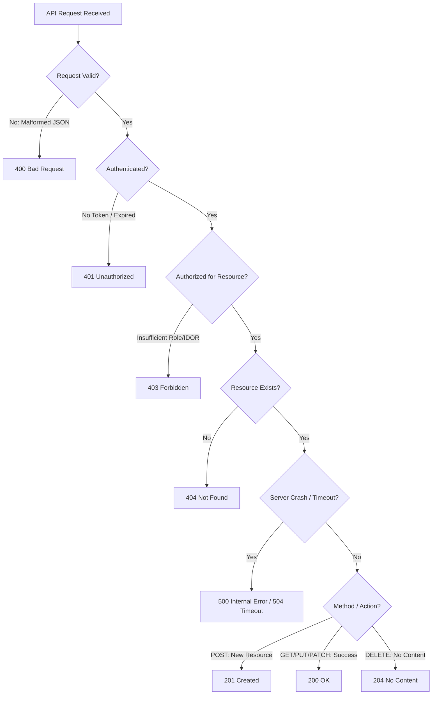

# HTTP Status Codes & Headers Cheat Sheet for API Testers

A practical decision matrix and cheat sheet for validating REST API status codes, error boundaries, and response security headers.

---

## 1. Status Codes Decision Tree



---

## 2. Status Codes Reference Matrix

| Category | Code | Meaning | Common QA Assertion Scenario |
| :--- | :--- | :--- | :--- |
| **2xx Success** | **200 OK** | Standard success | `GET /users/102`, `PUT /profile` |
| | **201 Created** | New resource created | `POST /orders` (returns `Location` header or created object) |
| | **202 Accepted** | Async processing started | `POST /export-report` (job queued for worker) |
| | **204 No Content** | Success, no body returned | `DELETE /items/45` |
| **3xx Redirect** | **301 Moved Permanently** | Permanent URL change | `http://` redirecting to `https://` |
| | **304 Not Modified** | Cached payload still fresh | Client sends `If-None-Match` (ETag validation) |
| **4xx Client Error** | **400 Bad Request** | Schema/syntax error | Missing required field, malformed JSON |
| | **401 Unauthorized** | Missing/invalid authentication | Bearer token expired, missing Authorization header |
| | **403 Forbidden** | Authenticated, but no permission | Regular customer trying to access admin endpoint (BFLA/BOLA) |
| | **404 Not Found** | Resource does not exist | `GET /products/non-existent-uuid` |
| | **409 Conflict** | State conflict / Duplicate | Registering an email that already exists in DB |
| | **422 Unprocessable Entity** | Semantic validation failed | Quantity is negative, birthdate is in the future |
| | **429 Too Many Requests** | Rate limit exceeded | Sending > 5 OTP requests per minute |
| **5xx Server Error** | **500 Internal Server Error** | Unhandled exception | Uncaught `NullPointerException`, DB down |
| | **502 Bad Gateway** | Upstream service failed | Nginx reverse proxy cannot reach Node/Java backend |
| | **503 Service Unavailable** | Server overloaded/maintenance | Health-check endpoint during deployment |
| | **504 Gateway Timeout** | Upstream timeout | Microservice query took > 30s |

---

## 3. Key Response Security Headers to Assert

```javascript
// Postman / JavaScript header validation snippet
pm.test("Security headers are present", function () {
    // 1. Prevent MIME-type sniffing
    pm.expect(pm.response.headers.get("X-Content-Type-Options")).to.eql("nosniff");
    
    // 2. Clickjacking protection
    pm.expect(pm.response.headers.get("X-Frame-Options")).to.be.oneOf(["DENY", "SAMEORIGIN"]);
    
    // 3. Strict HTTPS enforcement
    pm.expect(pm.response.headers.get("Strict-Transport-Security")).to.include("max-age=");
    
    // 4. Ensure no server banner leakage
    pm.expect(pm.response.headers.has("Server")).to.be.false;
});
```

---

## Related Guides

- [REST API Security & OWASP Checklist](/resources/api-security-testing-checklist) — interactive security audit checklist
- [Bulletproof API Assertions in Postman](/blog/bulletproof-api-assertions-postman) — test assertions guide
- [Interview Academy: API Testing](/interview-academy/api-testing-postman) — 50+ interview questions
