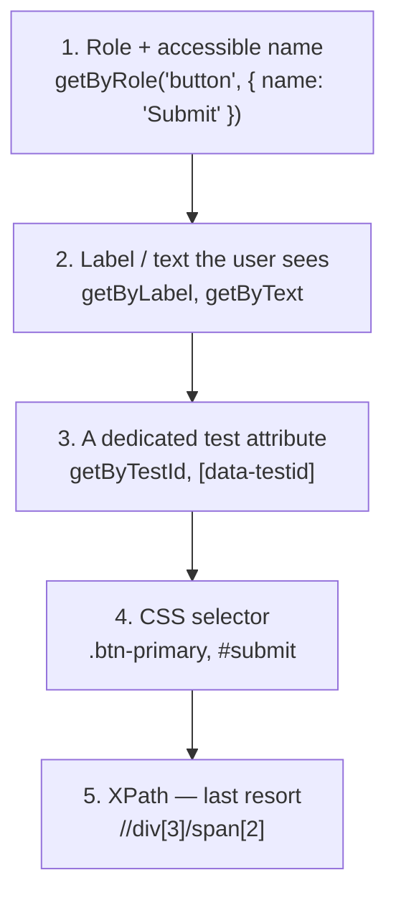

# Playwright & Selenium Locator Strategies Cheat Sheet

A condensed reference for picking the right locator strategy — the single biggest lever over whether a test suite stays stable or turns into a flaky-test graveyard.

---

## 1. Locator Priority Order



> [!IMPORTANT]
> **Rule of thumb**: locate elements the way a real user or screen reader would find them first (role, label, visible text). Reach for a `data-testid` when nothing user-facing is unique enough. Reach for CSS/XPath only when the first three genuinely don't work — they're the most likely to break on an unrelated layout or DOM refactor.

---

## 2. Playwright Locator Syntax

```typescript
// Role-based (preferred) — matches how assistive tech identifies elements
page.getByRole('button', { name: 'Submit' });
page.getByRole('textbox', { name: 'Email' });

// Label / text
page.getByLabel('Email address');
page.getByText('Payment successful');
page.getByPlaceholder('Search transactions...');

// Test ID (dedicated, stable hook)
page.getByTestId('submit-payment-button');

// CSS (fallback)
page.locator('.checkout-summary .total-amount');

// Chaining and filtering — narrow instead of writing one giant selector
page.getByRole('listitem').filter({ hasText: 'Order #1029' }).getByRole('button', { name: 'Cancel' });
```

## 3. Selenium Locator Syntax (Java)

```java
// By ID (preferred when a stable ID exists)
driver.findElement(By.id("submit-payment-button"));

// By CSS selector
driver.findElement(By.cssSelector(".checkout-summary .total-amount"));

// By link text / partial link text
driver.findElement(By.linkText("View Order History"));
driver.findElement(By.partialLinkText("Order #"));

// By XPath (last resort — most brittle against DOM changes)
driver.findElement(By.xpath("//button[text()='Submit']"));

// Relative XPath, scoped from a stable ancestor (more resilient than an absolute path)
driver.findElement(By.xpath("//div[@id='checkout-summary']//button"));
```

---

## 4. Playwright vs. Selenium — Equivalent Concepts

| Concept | Playwright | Selenium |
| :--- | :--- | :--- |
| Find by role/accessible name | `getByRole('button', {name: '...'})` | No direct equivalent — closest is `By.cssSelector('[role="button"]')` |
| Find by dedicated test hook | `getByTestId('...')` | `By.cssSelector('[data-testid="..."]')` |
| Auto-waiting for the element | Built-in — every action auto-waits | Requires explicit `WebDriverWait` + `ExpectedConditions` |
| Scoping a search to a container | `.locator()` chained off another locator | `element.findElement(By...)` from a parent `WebElement` |
| Asserting element state | `expect(locator).toBeVisible()` | Manual `assert` after a wait condition |

---

## 5. Fragile Patterns That Cause Flaky Tests

| Anti-pattern | Why it breaks | Fix |
| :--- | :--- | :--- |
| **Absolute XPath** (`/html/body/div[3]/div/span[2]`) | Breaks the moment any ancestor element is added, removed, or reordered | Use a relative XPath scoped from a stable, meaningful ancestor — or better, a role/testid locator |
| **Locating by auto-generated CSS class** (`.css-1x3f9k2`) | Framework-generated hashes regenerate on every build | Use a hand-authored `data-testid`, never a build tool's generated class |
| **`nth-child` / index-based selection** (`li:nth-child(3)`) | Silently selects the wrong item the moment list order changes | Filter by visible text/content instead of position (`getByText`, `.filter({hasText})`) |
| **Hardcoded `sleep()`/`Thread.sleep()` instead of a real wait condition** | Either too short (flaky) or too long (slow suite) — never actually correct | Use Playwright's built-in auto-wait, or Selenium's explicit `WebDriverWait` on a real condition |
| **One locator matching multiple elements silently** | In Selenium, `findElement` just grabs the first match — likely the wrong one | Playwright's strict mode throws immediately on ambiguity; in Selenium, narrow the selector until exactly one match is guaranteed |

---

## Related Guides

- [Automation Learning Path](/learning-paths/automation/introduction-to-automation-testing) — framework fundamentals, POM, and flaky-test management
- [Interview Academy: Selenium & Java](/interview-academy/selenium-java) — 50+ interview questions and answers
- [Interview Academy: Playwright & TypeScript](/interview-academy/playwright-typescript) — Playwright-specific interview questions and answers
