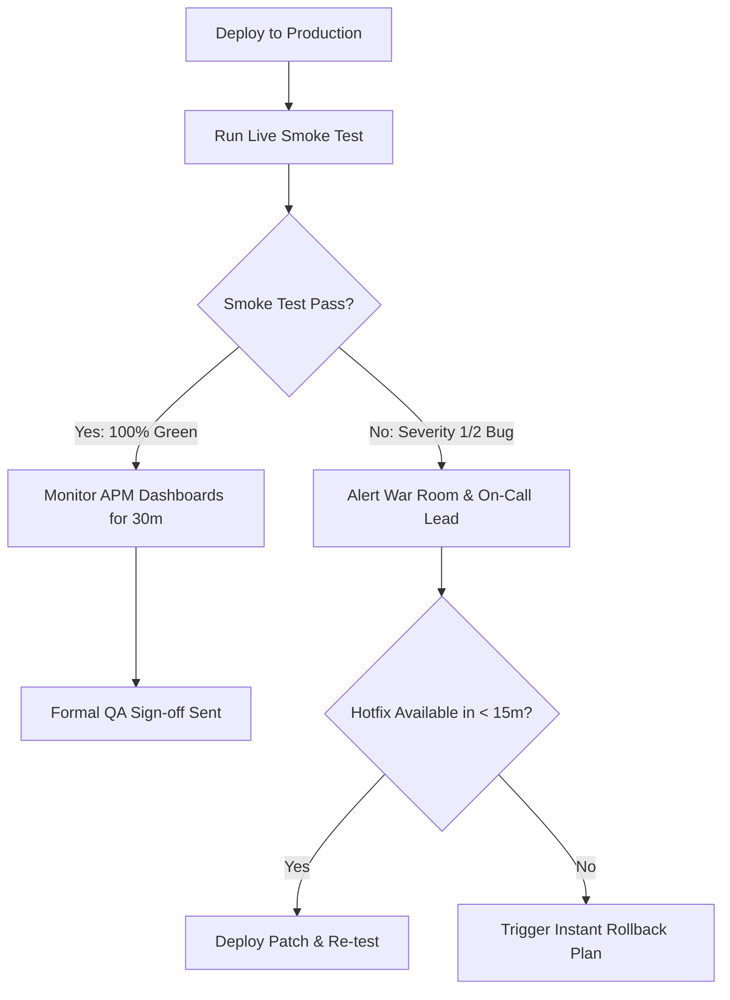

# Pre-Production Release & Smoke Sign-Off Checklist

A comprehensive, interactive checklist for QA leads, release managers, and DevOps teams to gate deployments into staging and production environments.

Track each gate directly on this page; all progress is saved automatically in your browser's local storage.

<InteractiveChecklist preset="release" />

---

## Deployment Escalation Matrix

---

## Related Guides

- [Performance Testing Strategy](/learning-paths/performance-testing/performance-testing-strategy) — ensure load SLOs are cleared before production
- [Database Performance & Transactions](/learning-paths/database-testing/database-performance-testing) — verify lock-free migrations
- [Pre-Load-Testing Checklist (JMeter)](/resources/pre-load-testing-checklist) — checklist for load and stress readiness
