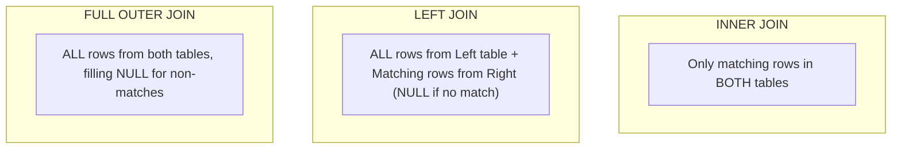

# SQL for QA & Testers Cheat Sheet

A condensed, print-and-use SQL reference guide tailored for database validation, backend data integrity testing, and data reconciliation.

---

## 1. SQL JOIN Types Visual Reference



### Quick Syntax

```sql
-- 1. INNER JOIN (Matching records only)
SELECT o.id, o.order_date, c.name, c.email
FROM orders o
INNER JOIN customers c ON o.customer_id = c.id;

-- 2. LEFT JOIN (Find orphan records / Missing references)
SELECT c.name, o.id AS order_id
FROM customers c
LEFT JOIN orders o ON c.id = o.customer_id
WHERE o.id IS NULL; -- Customers with ZERO orders

-- 3. SELF JOIN (Hierarchical validation: Employee -> Manager)
SELECT e.name AS employee, m.name AS manager
FROM employees e
LEFT JOIN employees m ON e.manager_id = m.id;
```

---

## 2. Aggregations & Grouping (`GROUP BY` vs `HAVING`)

> [!IMPORTANT]
> **Rule of Thumb**: `WHERE` filters rows **before** aggregation; `HAVING` filters aggregated metrics **after** grouping.

```sql
-- Find customer accounts with more than 5 failed transactions today
SELECT account_id, COUNT(*) AS failed_count, SUM(amount) AS total_failed_amount
FROM transactions
WHERE status = 'FAILED' 
  AND created_at >= CURRENT_DATE
GROUP BY account_id
HAVING COUNT(*) > 5
ORDER BY failed_count DESC;
```

---

## 3. Window Functions for QA Validation

```sql
-- 1. Find Duplicate Records
WITH RankedRows AS (
  SELECT id, email, created_at,
         ROW_NUMBER() OVER(PARTITION BY email ORDER BY created_at DESC) AS row_num
  FROM users
)
SELECT * FROM RankedRows WHERE row_num > 1;

-- 2. Find the 2nd Highest Salary / Transaction Amount
WITH RankedTransactions AS (
  SELECT id, account_id, amount,
         DENSE_RANK() OVER(ORDER BY amount DESC) AS rank_pos
  FROM transactions
)
SELECT * FROM RankedTransactions WHERE rank_pos = 2;

-- 3. Calculate Running Total (Financial Ledger Reconciliation)
SELECT id, account_id, amount, created_at,
       SUM(amount) OVER(PARTITION BY account_id ORDER BY created_at) AS running_balance
FROM ledger_entries;
```

---

## 4. NULL Handling Pitfalls

| Scenario | Flawed SQL (Buggy) | Correct SQL (QA Standard) | Why? |
| :--- | :--- | :--- | :--- |
| **Checking NULL** | `WHERE status = NULL` | `WHERE status IS NULL` | `NULL = NULL` evaluates to `UNKNOWN`, returning 0 rows. |
| **NOT IN with NULLs** | `WHERE id NOT IN (SELECT ref_id FROM t2)` | `WHERE id NOT IN (SELECT ref_id FROM t2 WHERE ref_id IS NOT NULL)` | If subquery returns a single `NULL`, `NOT IN` returns empty set. |
| **Default Fallback** | `SELECT amount + fee` | `SELECT COALESCE(amount, 0) + COALESCE(fee, 0)` | Any arithmetic with `NULL` yields `NULL`. |

---

## 5. Investigating Locks & Deadlocks (Postgres / MySQL)

```sql
-- Check active blocking queries in PostgreSQL
SELECT 
    blocked_activity.pid AS blocked_pid,
    blocked_activity.query AS blocked_query,
    blocking_activity.pid AS blocking_pid,
    blocking_activity.query AS blocking_query
FROM pg_catalog.pg_locks blocked_locks
JOIN pg_catalog.pg_stat_activity blocked_activity ON blocked_activity.pid = blocked_locks.pid
JOIN pg_catalog.pg_locks blocking_locks 
    ON blocking_locks.locktype = blocked_locks.locktype
    AND blocking_locks.database IS NOT DISTINCT FROM blocked_locks.database
    AND blocking_locks.relation IS NOT DISTINCT FROM blocked_locks.relation
JOIN pg_catalog.pg_stat_activity blocking_activity ON blocking_activity.pid = blocking_locks.pid
WHERE NOT blocked_locks.granted;
```

---

## Related Guides

- [Database Testing Learning Path](/learning-paths/category/database-testing) — full database testing foundations
- [Interview Academy: SQL & Databases](/interview-academy/sql-databases) — 50+ interview questions and answers
- [Database Deadlocks in QA Blog](/blog/database-deadlocks-concurrency-testing) — deep dive into concurrency testing
